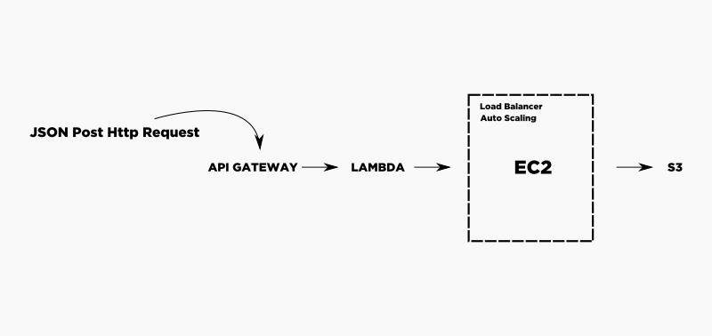

# Escalabilidade-UFAL-2016.2


## Arquitetura utilizada


A figura acima apresenta o esquema geral utilizado para o testador de carga.
- O usuário faz uma requisição POST com um JSON no formato:
```
{
'host': 'http://www.myurl.com',
'totalRequests': 'qtdTotaldeRequisicoes',
'distributionType':'distribution',
'email':'email@email.com',
'testName':'MyTest'
}
```
onde:
```
   - **host** indica a URL do sistema/site a ser testado
   - **totalRequests** indica a quantidade de requisições a serem feitas
   - **distributionType** indica a maneira com a qual as requisições serão feitas. As opções são: *Normal*; *Gausiana*,*xxxxxx*
   - **email** indica o email para o qual o relatório será enviado após a conclusão dos testes
   - **testName** indica o nome do teste dado pelo Usuário
```
- O API GateWay chama a função Lambda responsável em ativar o testador da EC2.

- Após a execução do testador (script python) os resultados ficam armazenados localmente e no S3.

    

## Código Lambda
- Executar com Python 3.6
- A biblioteca Requests é um dependência (código já compactado)


## API GATEWAY
- método POST
- Formato (JSON) da requisição a ser enviada:
```
{
'host': 'http://www.myurl.com',
'totalRequests': 'qtdTotaldeRequisicoes',
'distributionType':'distribution',
'email':'email@email.com',
'testName':'MyTest'
}
```

 ## Python
 - qrequests;
 - boto3;
 - numpy;
 - resource.
